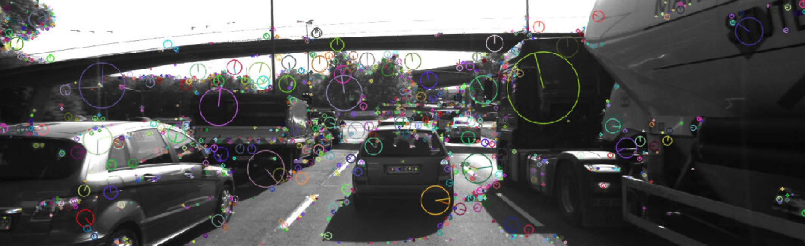

# 2D Feature Tracking (Camera Based)


The idea behind this work is to setup appropriate framework for a camera-lidar based collision detection/avoidance system. For this purpose, a camera-based 2D feature tracker is built here and various detector / descriptor combinations are tested, to see which ones perform best. There are four-parts to the project:

* loading images, setting up data structures and putting everything into a ring buffer to optimize memory load.
* integrate several keypoint detectors such as HARRIS, FAST, BRISK and SIFT and compare them with regard to number of keypoints and speed.
* then focus on descriptor extraction and matching using brute force and also the FLANN approach.
* once the code framework is complete, test various algorithms in different combinations and compare them with regard to some performance measures.

## Dependencies for Running Locally
* cmake >= 2.8
  * All OSes: [click here for installation instructions](https://cmake.org/install/)
* make >= 4.1 (Linux, Mac), 3.81 (Windows)
  * Linux: make is installed by default on most Linux distros
  * Mac: [install Xcode command line tools to get make](https://developer.apple.com/xcode/features/)
  * Windows: [Click here for installation instructions](http://gnuwin32.sourceforge.net/packages/make.htm)
* OpenCV >= 4.1
  * This must be compiled from source using the `-D OPENCV_ENABLE_NONFREE=ON` cmake flag for testing the SIFT and SURF detectors.
  * The OpenCV 4.1.0 source code can be found [here](https://github.com/opencv/opencv/tree/4.1.0)
* gcc/g++ >= 5.4
  * Linux: gcc / g++ is installed by default on most Linux distros
  * Mac: same deal as make - [install Xcode command line tools](https://developer.apple.com/xcode/features/)
  * Windows: recommend using [MinGW](http://www.mingw.org/)

## Basic Build Instructions

1. Clone this repo.
2. Make a build directory in the top level directory: `mkdir build && cd build`
3. Compile: `cmake .. && make`
4. Run it: `./2D_feature_tracking`.

## Results

After implementation of keypoint-detection, descriptor extraction and keypoint-matching in consecutive images, the results obtained are presented in the following sections. Here are some notes on the results:

* AKAZE detector works only with AKAZE descriptor
* For matching with SIFT descriptor we need to use FLANN. SIFT does not work with BF
* SIFT detector and ORB descriptor do not work together
* for SHITOMASI blockSize of 4 has been used
* for HARRIS blockSize of 2 has been used

#### Keypoint-detected

Total number of keypoints detected by each method for every image are listed in the table bellow:

|  | SHITOMASI |	HARRIS	| FAST	| BRISK	| ORB	| AKAZE	| SIFT |
|:------:|:------:|:------:|:------:|:------:|:------:|:------:|:------:|
| img-0	| 1370	| 339	| 1824	| 2757	| 500	| 1351	| 1438
| img-1	| 1301	| 286	| 1832	| 2777	| 500	| 1327	| 1371
| img-2	| 1361	| 349	| 1810	| 2741	| 500	| 1311	| 1380
| img-3	| 1358	| 356	| 1817	| 2735	| 500	| 1351	| 1335
| img-4	| 1333	| 521	| 1793	| 2757	| 500	| 1360	| 1305
| img-5	| 1284	| 2611| 1796	| 2695	| 500	| 1347	| 1370
| img-6	| 1322	| 200	| 1788	| 2715	| 500	| 1363	| 1396
| img-7	| 1366	| 806	| 1695	| 2628	| 500	| 1331	| 1382
| img-8	| 1389	| 572	| 1749	| 2639	| 500	| 1357	| 1463
| img-9	| 1339	| 1471	| 1770	| 2672	| 500	| 1331	| 1422

Corresponding time taken in detection is shown in the plot here along with a sample output for `AKAZE` descriptor:





Associated number of keypoints detected on preceding vehicle in the images are:

|  | SHITOMASI |	HARRIS	| FAST	| BRISK	| ORB	| AKAZE	| SIFT |
|:------:|:------:|:------:|:------:|:------:|:------:|:------:|:------:|
| img-0 | 715 | 190 | 970 | 1472 | 280 | 727 | 771 |
| img-1 | 680 | 162 | 974 | 1494 | 277 | 710 | 731 |
| img-2 | 716 | 201 | 967 | 1480 | 280 | 705 | 734 |
| img-3 | 705 | 202 | 970 | 1467 | 282 | 724 | 714 |
| img-4 | 699 | 299 | 954 | 1487 | 284 | 733 | 702 |
| img-5 | 672 | 1454 | 961 | 1450 | 288 | 724 | 741 |
| img-6 | 690 | 115 | 957 | 1463 | 288 | 736 | 749 |
| img-7 | 711 | 461 | 908 | 1412 | 289 | 720 | 745 |
| img-8 | 722 | 328 | 928 | 1417 | 287 | 736 | 791 |
| img-9 | 698 | 823 | 940 | 1429 | 292 | 725 | 757 |


#### Neighborhood size

As far as distribution of neighborhood size of keypoints detected on preceding vehicle is concerned, some of the detector methods have fixed neighborhood sizes, namely:

* SHITOMASI -- 4
* HARRIS -- 6
* FAST -- 7

while others have a distribution, among which ORB seems to have large spread. The distribution is shown in following four figures and standard deviation is tabulated here:

| detector | BRISK | ORB | AKAZE | SIFT |
|:------:|:------:|:------:|:------:|:------:|
| standard-deviation| 14.40 | 25.83 | 3.43 | 6.30 |


|  |  |
|:------:|:------:|
|  |  |


#### matched keypoints


A mean of the number of matched keypoints for all 10 images using all possible combinations of detectors and descriptors is shown here.


The details for every single combination of detectors and descriptors with corresponding matched points are also provided in the following table for reference

Total number of matched keypoints for each combination:

|  |  |
|:------:|:------:|
|  |  |
|  |  |
|  |  |


A sample matched-pair with ORB-FREAK combination is shown here:


#### Time-taken

The mean of time taken for keypoint detection and descriptor extraction for all combinations is listed below.


These results and all others presented above are derived from data that can be found in the [results excel-sheet](./results/results.xlsx)


## Recommendation

In a dynamic scenario like autonomous driving, the speed and accuracy of detection are of utmost importance. Hence, to arrive at recommendation, I computed the ratio of mean-matched-keypoints to mean-detection-extraction-time, defining a score parameter as:

```
score = 1000 * (mean-matched-keypoints / mean-detection-extraction-time)
```

The corresponding scores are shown in image below, with highest three highlighted in different shades of green.


Based on these scores my recommendations are:


| rank | detector | descriptor |
|:------:|:------:|:------:|
| 1 | FAST | ORB |
| 2 | FAST | BRIEF |
| 3 | SHITOMASI | BRIEF |
